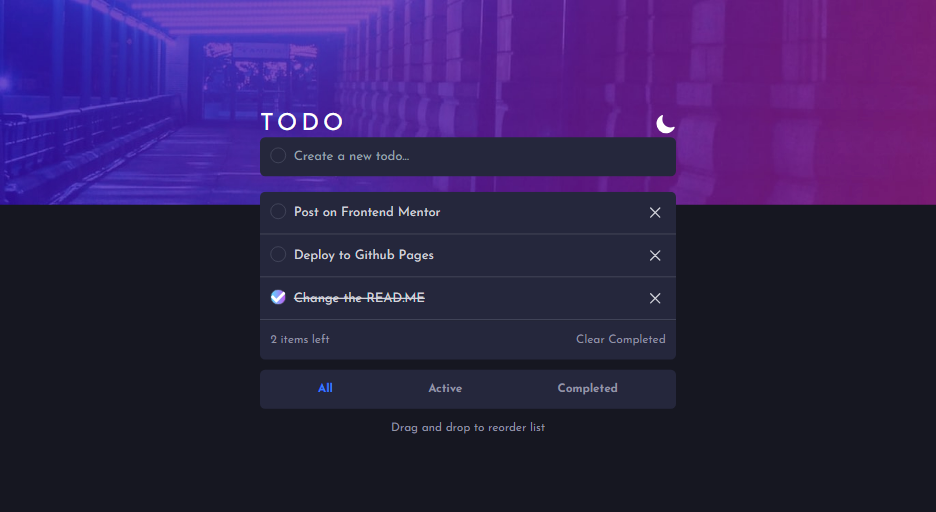

# Frontend Mentor - Todo app solution

This is a solution to the [Todo app challenge on Frontend Mentor](https://www.frontendmentor.io/challenges/todo-app-Su1_KokOW). Frontend Mentor challenges help you improve your coding skills by building realistic projects.

## Table of contents

- [Overview](#overview)
  - [The challenge](#the-challenge)
  - [Screenshot](#screenshot)
  - [Links](#links)
- [My process](#my-process)
  - [Built with](#built-with)
  - [What I learned](#what-i-learned)
  - [Continued development](#continued-development)
  - [Useful resources](#useful-resources)
- [Author](#author)

## Overview

### The challenge

Users should be able to:

- View the optimal layout for the app depending on their device's screen size
- See hover states for all interactive elements on the page
- Add new todos to the list
- Mark todos as complete
- Delete todos from the list
- Filter by all/active/complete todos
- Clear all completed todos
- Toggle light and dark mode
- **Bonus**: Drag and drop to reorder items on the list

### Screenshot



### Links

- Live Site URL: [TODO](https://jlsoaresramos.github.io/todo/)

## My process

### Built with

- Semantic HTML5 markup
- CSS custom properties
- Flexbox
- Mobile-first workflow
- [React](https://reactjs.org/) - JS library
- [vitejs](https://vitejs.dev/) - React framework
- [TailwindCSS](https://tailwindcss.com/) - For styles

### What I learned

- I extensively used the Context API for this challenge. It's a great way to make the logic cleaner.

- It was my first time using the Drag and Drop API. I didn't even know that was possible in HTML, so it was nice to learn about it.

- I employed conditional types in TypeScript, as you can see in the code below. I created a component that can be an input of type text or a functional checkbox. I used this to maintain the same style.

```tsx
interface InputAddProps extends React.HTMLProps<HTMLInputElement> {
	id: string
	type: 'add'
}

export type InputShowProps = {
	type: 'show'

	id: string
	description: string
	done: boolean
}

type descriptionProps = {
	id: string
	className?: string
} & (InputAddProps | InputShowProps)
```

- I also used a lot of the filter function from JavaScript to handle deletion and filtering. As you can see below in this useEffect, I used filter to determine how many tasks are left to be done:

```tsx
	useEffect(() => {
		let tasksToDo = tasks.filter((task) => task.done === false).length
		setTasksLeft(tasksToDo)

		if (tasks.length > 0) {
			localStorage.setItem('tasks', JSON.stringify(tasks))
		} else {
			localStorage.removeItem('tasks')
		}
	}, [tasks])
```

- Additionally, as you can see, I stored your tasks in localStorage.

And that's it! If you have any questions or need further clarification, feel free to ask.

### Continued development

Given my previous focus on layout work, particularly with CSS and HTML, I've encountered difficulties when it comes to handling more logic-centric tasks. To evolve as a developer, I recognize the pressing need to enhance my skills in this domain. My recent task served as a reminder of the importance of strengthening my logical and programming abilities.

### Useful resources

- [W3Schools](https://www.w3schools.com/html/html5_draganddrop.asp) - This helped to understand the Drag and Drop API 
- [uuid](https://github.com/uuidjs/uuid) - This helped me to generate unique ID's for my tasks
- [tailwind-merge](https://github.com/dcastil/tailwind-merge) - This is really good for merge classes
- [pingback](https://pingback.com/gabcodes/checkbox-customizado-com-css) - This article helped me to stylized my checkbox
- [gh-pages](https://github.com/tschaub/gh-pages) - And again i deployed to github pages with this amazing tool
- [prettier](https://prettier.io/) - I used to make my code more prettier...
- [Josh tried coding](https://www.youtube.com/watch?v=9i38FPugxB8&t=303s) - I watched this video for make a conditional typed component. It's a nice trick from Typescript
- **Bonus**: [developedbyed](https://www.youtube.com/@developedbyed) - This guy is also amazing

## Author

- Frontend Mentor - [@JLSoaresRamos](https://www.frontendmentor.io/profile/JLSoaresRamos)
- Linkedin - [@jlramossoares](https://www.linkedin.com/in/jlramossoares/) 
